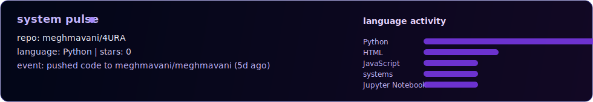
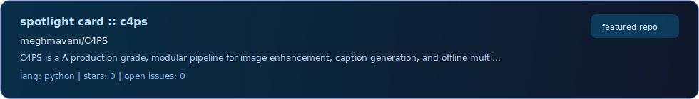

<p align="center">
  
</p>

<p align="center">
  
</p>

<p align="center">
  
  
  
</p>

<p align="center">
  <a href="#command-center"></a>
  <a href="#live-feed"></a>
  <a href="#github-telemetry"></a>
</p>

<p align="center">
  <a href="https://github.com/meghmavani?tab=repositories"></a>
  <a href="https://www.linkedin.com/megh-mavani"></a>
  <a href="https://huggingface.co/revan1te/"></a>
  <a href="mailto:mavanimegh@gmail.com"></a>
</p>

<p align="center">
  
  
  
</p>

## command center

computer science student building ai systems that go beyond static model outputs.
i focus on systems that perceive, adapt, and act under real constraints.

```txt
real systems > toy notebooks
modular pipelines > tangled scripts
ship fast -> break -> fix -> improve
systems thinking > isolated model scores
```

<p align="center">
  
</p>

## live feed

<p align="center">
  
</p>

<p align="center">
  
</p>

<p align="center">
  
</p>

## what i build

- agentic ai systems with action loops, not just text outputs
- computer vision pipelines for video understanding
- llm workflows with bug detection and auto-fix loops
- modular multi-model systems with clean interfaces

## tech surface

<!-- TECH-STACK:START -->
<p>
  
  
  
  
  
  
  
</p>
<!-- TECH-STACK:END -->

## github telemetry

<p align="center">
  
</p>

<p align="center">
  
</p>

<p align="center">
  
  
</p>

<p align="center">
  
</p>
## contribution snake

<p align="center">
  
</p>
