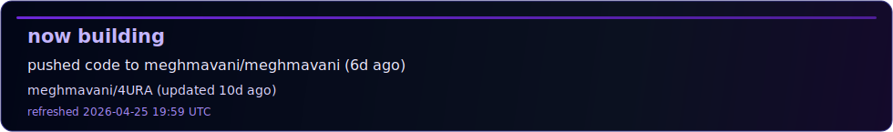

<p align="center">
  
</p>

<p align="center">
  
</p>

<p align="center">
  <a href="https://github.com/meghmavani?tab=repositories"></a>
  <a href="https://www.linkedin.com/megh-mavani"></a>
  <a href="https://huggingface.co/revan1te/"></a>
  <a href="mailto:mavanimegh@gmail.com"></a>
</p>

<p align="center">
  <a href="https://github.com/meghmavani/meghmavani/actions/workflows/latest-contrib-workflow.yml"></a>
  <a href="https://github.com/meghmavani/meghmavani/actions/workflows/snake-workflow.yml"></a>
</p>

## about

computer science student building ai systems that go beyond static model outputs.

i focus on systems that perceive, adapt, and act under real constraints.

## what i build

- agentic ai systems with action loops, not just text outputs
- computer vision pipelines for video understanding
- llm workflows with bug detection and auto-fix loops
- modular multi-model systems with clean interfaces

## live feed

<p align="center">
  
</p>

<details open>
<summary><strong>activity pulse</strong></summary>

<!-- LATEST-CONTRIB:START -->
- latest repo: [meghmavani/Folder-Cleaner](https://github.com/meghmavani/Folder-Cleaner) (updated 1h ago)
- latest contribution: pushed code to meghmavani/meghmavani (just now)
- current focus hint: Do you find it tedious to delete specific files from a large directory? Are you tired of manually sifting t...
<!-- LATEST-CONTRIB:END -->

</details>

<details open>
<summary><strong>repo spotlight</strong> (fixed)</summary>

<!-- PROJECT-SPOTLIGHT:START -->
- repo spotlight: [meghmavani/C4PS](https://github.com/meghmavani/C4PS)
- why this one: C4PS is a A production grade, modular pipeline for image enhancement, caption generation, and offline multi...
- signal: python project, 0 stars
<!-- PROJECT-SPOTLIGHT:END -->

</details>

## system snapshots

<details>
<summary><strong>nova</strong></summary>

multi-model vehicular analysis for traffic and pedestrian intelligence.

</details>

<details>
<summary><strong>video understanding pipeline</strong></summary>

r3d_18 + resnet50 + yolo in one modular perception stack.

</details>

<details>
<summary><strong>codegen + autofix loop</strong></summary>

generate code, detect bugs, patch, re-run, repeat.

</details>

<details>
<summary><strong>emotional ai engine</strong></summary>

plutchik-based modeling with time-windowed memory and manipulation signal tracking.

</details>

## philosophy

```txt
real systems > toy notebooks
modular pipelines > tangled scripts
ship fast -> break -> fix -> improve
systems thinking > isolated model scores
```

## tech surface

<!-- TECH-STACK:START -->
<p>
  
  
  
  
  
  
  
</p>
<!-- TECH-STACK:END -->

## github telemetry

<p align="center">
  
  
</p>

<p align="center">
  
</p>

## contribution snake

<p align="center">
  
</p>
