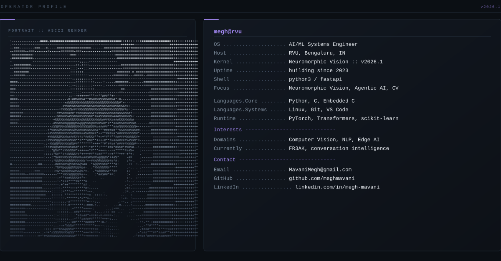
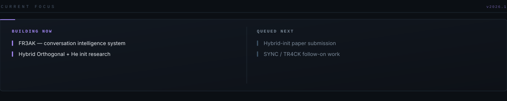

  

  

  

  

### SYSTEM PULSE

<table>
  <tr>
    <td>
      
    </td>
    <td>
      
    </td>
  </tr>
</table>

  

 

  

  

### CAPABILITIES

<code>Neuromorphic Perception · Object Tracking · Agentic AI · Computer Vision · RAG · Conversation Intelligence · Edge Inference</code>

 

<strong>AI / ML</strong>

<strong>COMPUTER VISION &amp; EDGE</strong>

<strong>BACKEND &amp; SYSTEMS</strong>

<strong>DATA &amp; TOOLS</strong>

### ACTIVE SYSTEMS

  
  

  <code>Conversation Intelligence · Agentic AI · Behavioral Modeling</code>

  

### OPEN CHANNEL

 

  
   
  <code>meghmavani/meghmavani · v2026.1</code>
    
  

